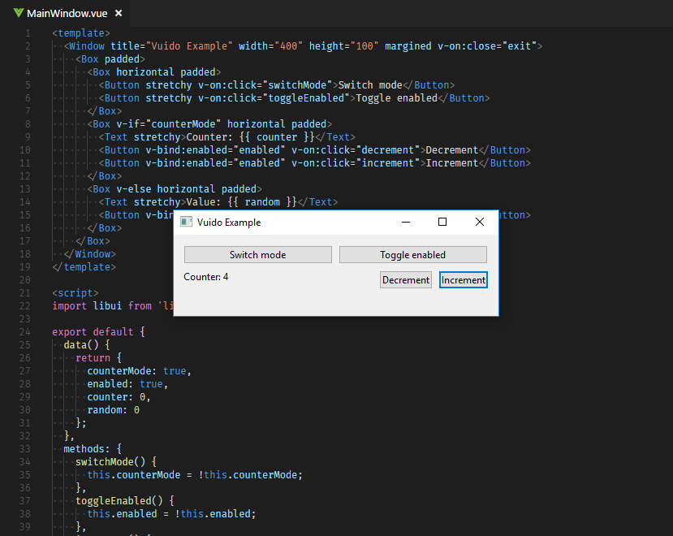

# Vuido

Create native desktop applications for Windows, OS X and Linux using Vue.js.

 

### Introduction

Vuido makes it possible to create lightweight, native desktop applications using Vue.js. They can run on Windows, OS X and Linux, using native GUI components, and don't require Electron.

Vuido uses the [libui](https://github.com/andlabs/libui) library which provides native GUI components for each desktop platform, and the [libui-node](https://github.com/parro-it/libui-node) bindings for Node.js.

Vuido works with Vue.js extensions, such as Vuex, and it's compatible with standard Node.js modules.

At the moment Vuido is in a very early stage of development. The first goal is to implement all controls currently supported by libui and to write a documentation.

