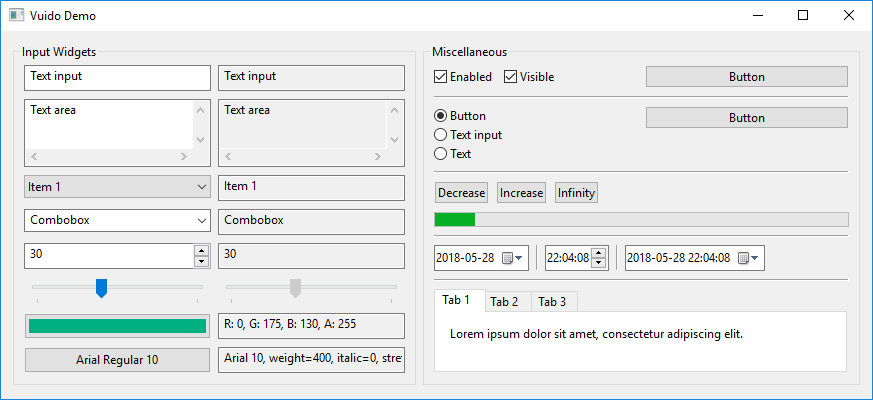

# Introduction

## What is Vuido?

Vuido is a framework for creating native desktop applications based on [Vue.js](https://vuejs.org/). Applications using Vuido can run on Windows, OS X and Linux, using native GUI components, and don't require Electron.

Under the hood, Vuido uses the [libui](https://github.com/andlabs/libui) library which provides native GUI components for each desktop platform, and the [libui-node](https://github.com/parro-it/libui-node) bindings for Node.js.

## Why Vuido?

Vuido is a cross-platform JavaScript framework which supports Windows, OS X and Linux. Applications using Vuido have the native look and feel on each platform, without having to write separate code or to use platform specific programming languages.

Vuido is very lightweight compared to other frameworks, such as Electron or NW.js. The size of a simple Vuido application is about 20 MB, while a typical Electron application takes 90 MB or more. Applications using Vuido also take less memory and have faster startup time.

Vuido is based on Vue.js, a progressive JavaScript framework for building user interfaces. Vuido supports most of the standard Vue.js API. It's also compatible with many Vue.js extensions, for example Vuex. You can design the user interface using the powerful Vue.js template syntax and single-file components.

Applications using Vuido can also use the standard Node.js API, for example the file system and http modules, and any third-party packages compatible with Node.js.

## Development Status

Currently Vuido implements the basic containers and widgets supported by libui. It is ready to be used for creating simple applications. For an example of a real life application created using Vuido, see the [LaunchUI Packager GUI](https://github.com/mimecorg/launchui-packager-gui) project.

Bug reports and feature requests are welcome, however please look for a related issue in the [libui](https://github.com/andlabs/libui) project first, because Vuido can only implement functionality which is already implemented in libui.

## Acknowledgements

Vuido is largely based on Vue.js and shares most of its code, except for the platform specific code related to libui.

Vuido was inspired by [Proton Native](https://github.com/kusti8/proton-native), an environment for creating native desktop applications using React.

## License

Vuido is licensed under the MIT license.

Copyright \(C\) 2018 Michał Męciński.

